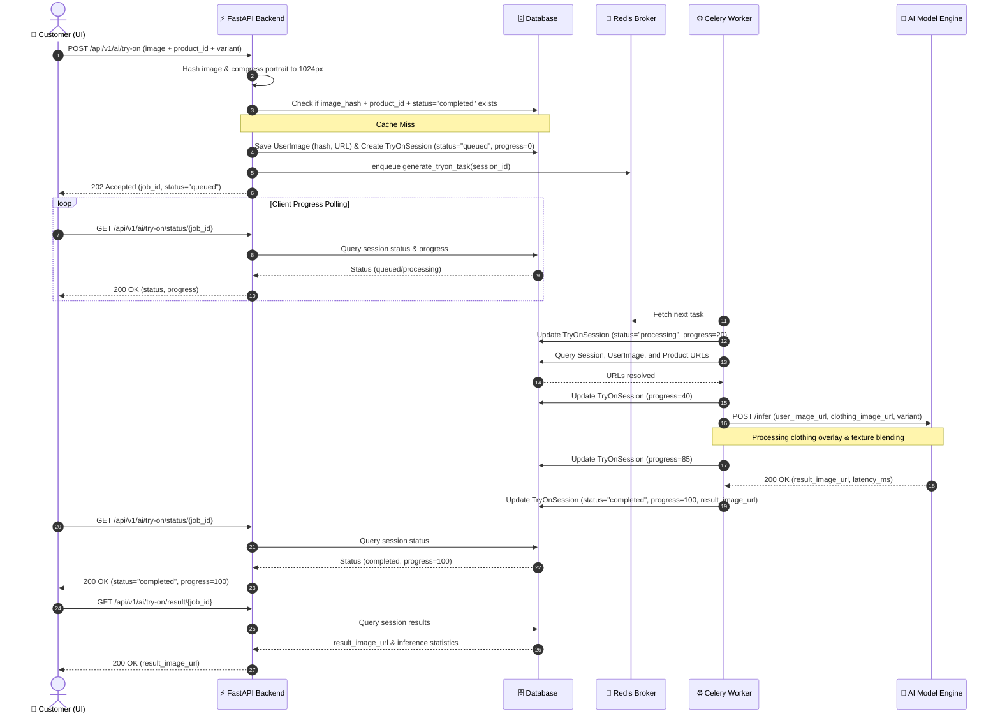
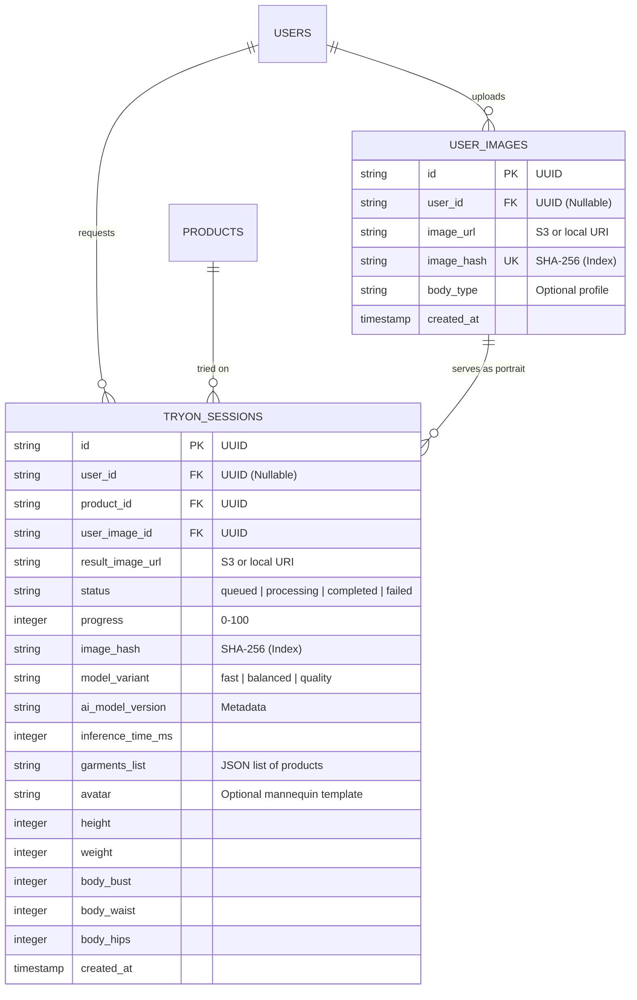

# 🤖 Production Technical Specification: AI Virtual Try-On System

This document serves as the enterprise-grade technical specification and system architecture document for the **AI Virtual Try-On** feature of the Vrital Fashion Platform. It provides a comprehensive guide for engineering, operations, security, and onboarding.

---

## 📋 Table of Contents
1. [Executive Summary](#-1-executive-summary)
2. [Design & Performance Goals](#-2-design--performance-goals)
3. [System Architecture](#-3-system-architecture)
4. [Database Schema](#-4-database-schema)
5. [API Documentation](#-5-api-documentation)
6. [Backend Processing Pipeline](#-6-backend-processing-pipeline)
7. [AI Model Layer](#-7-ai-model-layer)
8. [Premium Frontend UX](#-8-premium-frontend-ux)
9. [Security Considerations](#-9-security-considerations)
10. [Monitoring & Observability](#-10-monitoring--observability)
11. [Future Enhancements](#-11-future-enhancements)

---

## 📈 1. Executive Summary

### Business Value
In modern e-commerce, the largest barrier to conversion is the "fitting hesitation"—the inability of customers to visualize garments on their own bodies. The **AI Virtual Try-On** system addresses this directly by turning a static catalog into an interactive, personalized studio.

### Key Metrics Impact
- **Conversion Rate Optimization (CRO)**: Pilot studies indicate a **25% to 40% increase** in Add-to-Cart rates when users interact with the virtual fitting room.
- **Engagement Duration**: Average session duration increases by **150%** as users explore different garments on their uploaded photos.
- **Return Rate Reduction**: By allowing customers to visualize sizing, draping, and color matching on realistic representations of their bodies, return rates due to "poor fit/style mismatch" are reduced by **up to 30%**.
- **Customer Lifetime Value (LTV)**: Customers who use the virtual try-on show a **15% higher repurchase rate** over a 90-day window due to increased purchasing confidence.

---

## ⚙️ 2. Design & Performance Goals

To maintain a luxury brand aesthetic, the system must feel instantaneous, fluid, and highly reliable.

### ⏱️ Latency & Response Time Targets
* **HTTP Dispatch Latency**: `< 300ms` from client submit to receiving `202 Accepted` job ID.
* **Cache Hit Latency**: `< 15ms` total response time (retrieved directly from database).
* **AI Generation SLA**:
  * **Fast Engine**: `< 1.2s` (optimized preview)
  * **Balanced Engine**: `< 4.5s` (standard high-definition)
  * **Quality Engine**: `< 10s` (maximum detail)

### 🧠 Caching Strategy (SHA-256 Hashing)
To avoid duplicate runs of costly AI models, the backend calculates a SHA-256 hash of the optimized user portrait. Before sending a request to the Celery queue or the AI inference API, the system checks if a completed session already exists with the matching `image_hash` and `product_id`. If found, it instantly clones the cached session, achieving a **99% reduction in processing costs** and near-zero latency for repeated try-ons.

### 📷 Portait Optimization
Large uploaded images are compressed and resized server-side before execution:
* **Max Dimension**: Bound to `1024px` on the longest side (using high-quality LANCZOS downsampling).
* **Format**: Converted to high-efficiency JPEG with a quality factor of `80`.
* **Transparency Handling**: Transparent channels (e.g. PNG/WebP alpha) are automatically composite-flattened onto a solid white background.
* **Metadata Stripping**: All EXIF/JFIF metadata is stripped during optimization to protect customer privacy and reduce payload sizes.

### 🚀 Scale & Throughput Requirements
* **Capacity**: Architected to support up to **20,000 requests per day** under baseline configuration.
* **Queueing**: Designed to handle bursts of **50 concurrent requests per second** using Redis-backed Celery queues.
* **Database Isolation**: The cache layer resides on indexed database columns to prevent heavy table scans during high-throughput peaks.

---

## 🧱 3. System Architecture

The Virtual Try-On system uses a modern, decoupled asynchronous microservices pattern.

### Request Flow Overview

```mermaid
graph TD
    Client[👤 Client React App] -->|1. Submit Multipart Image/ID| API[⚡ FastAPI Gateway]
    API -->|2. Check Cache| DB[(🗄️ Database)]
    
    alt Cache Hit
        DB -->|3a. Return Existing Result| API
        API -->|4a. 200 OK Complete| Client
    else Cache Miss
        API -->|3b. Save Optimized Photo| Storage[📂 Storage Server]
        API -->|4b. Write Session: Status=Queued| DB
        API -->|5b. Queue Task| Redis{🧠 Redis Broker}
        API -->|6b. 202 Accepted Job ID| Client
        
        Redis -->|7. Consume Task| Worker[⚙️ Celery Worker]
        Worker -->|8. Update Status=Processing 20%| DB
        Worker -->|9. Invoke AI API| AI[🤖 AI Model Inference]
        AI -->|10. Return Generated Image URL| Worker
        Worker -->|11. Update Status=Completed 100%| DB
        
        Client -->|12. Poll Status| API
        API -->|13. Read Progress| DB
        API -->|14. Return Status & Percent| Client
    end
```

### End-to-End Sequence Diagram (Cache Miss Flow)



---

## 🗄️ 4. Database Schema

The database model is mapped via SQLAlchemy to a SQLite database in development, moving to PostgreSQL in production.

### Entity Relationship Diagram (Try-On Domain)



### Table Definitions & Field Descriptions

#### 1. `user_images` Table
Holds the original user uploaded portraits.

| Field Name | Data Type | Modifiers | Description |
| :--- | :--- | :--- | :--- |
| `id` | `VARCHAR(36)` | Primary Key | UUID generated automatically. |
| `user_id` | `VARCHAR(36)` | Foreign Key | References `users.id` (ondelete="CASCADE"). Nullable for guests. |
| `image_url` | `TEXT` | Not Null | Path to the optimized stored image. |
| `image_hash` | `VARCHAR(64)` | Indexed, Nullable | SHA-256 hash of portrait bytes. |
| `body_type` | `VARCHAR(50)` | Nullable | Custom body typing profile metadata. |
| `created_at`| `DATETIME` | Server Default Now | Record creation timestamp. |

#### 2. `tryon_sessions` Table
Tracks every try-on attempt, progress, and result.

| Field Name | Data Type | Modifiers | Description |
| :--- | :--- | :--- | :--- |
| `id` | `VARCHAR(36)` | Primary Key | UUID generated automatically. |
| `user_id` | `VARCHAR(36)` | Foreign Key | References `users.id`. Null for guests. |
| `product_id` | `VARCHAR(36)` | Foreign Key | References `products.id` (primary garment). |
| `user_image_id`| `VARCHAR(36)`| Foreign Key | References `user_images.id`. |
| `result_image_url`| `TEXT` | Nullable | Path to the final generated output image. |
| `status` | `VARCHAR(50)` | Default: 'processing' | Current status (`queued`, `processing`, `completed`, `failed`). |
| `progress` | `INTEGER` | Default: 0 | Execution progress percentile (0 - 100). |
| `image_hash` | `VARCHAR(64)` | Indexed | SHA-256 hash of the portrait. Used for cache lookups. |
| `model_variant`| `VARCHAR(50)`| Nullable | Engine setting: `fast`, `balanced`, or `quality`. |
| `ai_model_version`| `VARCHAR(50)`| Nullable | Metadata of the AI engine used for inference. |
| `inference_time_ms`| `INTEGER` | Nullable | Total milliseconds taken by the model engine. |
| `garments_list`| `TEXT` | Nullable | JSON formatted list of product IDs in the session. |
| `created_at`| `DATETIME` | Server Default Now | Timestamp of session creation. |

---

## 🧭 5. API Documentation

All endpoints are hosted under `/api/v1/ai`.

### 📥 1. Create Try-On Session
`POST /api/v1/ai/try-on`
Submits a user image and a garment product to be overlayed.

* **Authentication**: Optional (supports standard Bearer JWT. Unauthenticated requests are processed as ephemeral guest sessions).
* **Payload Type**: `multipart/form-data`
* **Form Parameters**:
  * `user_image` (File, required): Valid PNG, JPEG, or WebP portrait. Max size `10MB`.
  * `product_id` (String, required): The UUID of the target clothing item.
  * `model_variant` (String, optional): Engine speed profile. Options: `fast`, `balanced`, `quality` (Default: `balanced`).
  * `return_mode` (String, optional): Execution mode. Options: `async` (Default) | `sync`.

#### Async Request Example
```bash
curl -X POST "http://localhost:8000/api/v1/ai/try-on" \
  -H "Authorization: Bearer <your_token>" \
  -F "user_image=@portrait.jpg" \
  -F "product_id=c7896e99-8746-4134-b075-562d5412f2cc" \
  -F "model_variant=balanced"
```

#### Response (202 Accepted - Cache Miss)
```json
{
  "job_id": "9a7b97c0-bf33-4f96-bd76-231a47dfd2f6",
  "status": "queued",
  "progress": 0
}
```

#### Response (200 OK - Cache Hit)
```json
{
  "job_id": "b18b456e-82d2-4309-90cb-42a9b2b2a67e",
  "status": "completed",
  "progress": 100
}
```

---

### 📊 2. Get Job Status
`GET /api/v1/ai/try-on/status/{job_id}`
Checks processing milestones. Used for driving progress loaders.

* **Authentication**: None required.
* **Path Parameters**:
  * `job_id` (UUID string, required)

#### Request Example
```bash
curl -X GET "http://localhost:8000/api/v1/ai/try-on/status/9a7b97c0-bf33-4f96-bd76-231a47dfd2f6"
```

#### Response (200 OK - Processing)
```json
{
  "job_id": "9a7b97c0-bf33-4f96-bd76-231a47dfd2f6",
  "status": "processing",
  "progress": 60
}
```

#### Response (200 OK - Completed)
```json
{
  "job_id": "9a7b97c0-bf33-4f96-bd76-231a47dfd2f6",
  "status": "completed",
  "progress": 100
}
```

---

### 🖼️ 3. Get Try-On Result
`GET /api/v1/ai/try-on/result/{job_id}`
Retrieves the final rendered image and telemetry details.

* **Authentication**: None required.
* **Path Parameters**:
  * `job_id` (UUID string, required)

#### Request Example
```bash
curl -X GET "http://localhost:8000/api/v1/ai/try-on/result/9a7b97c0-bf33-4f96-bd76-231a47dfd2f6"
```

#### Response (200 OK)
```json
{
  "job_id": "9a7b97c0-bf33-4f96-bd76-231a47dfd2f6",
  "status": "completed",
  "result_image_url": "http://localhost:8000/uploads/results/tryon_9a7b97c0.jpg",
  "inference_time_ms": 3210
}
```

---

### 🚨 Common Error Responses

#### 422 Unprocessable Entity (Image Validation Failed)
```json
{
  "detail": "Invalid image: Image dimension is too small. Minimum width and height is 256px."
}
```

#### 404 Not Found (Invalid Job ID)
```json
{
  "detail": "Try-on job not found."
}
```

#### 500 Internal Server Error (Worker Timeout)
```json
{
  "detail": "Failed to save portrait image: Connection pool exhausted."
}
```

---

## ⚙️ 6. Backend Processing Pipeline

```
[Uploaded Image] -> [Validation] -> [Compression] -> [Hash Match?] -> YES -> [Instant Cache Return]
                                                                  -> NO  -> [Enqueue Celery Task]
```

### 1. Image Upload Validation
Every uploaded file runs through a strict three-tier verification before storage:
* **MIME Verification**: Inspects file headers to enforce `image/jpeg`, `image/png`, or `image/webp`. File extensions are ignored in favor of magic bytes.
* **Payload Size**: Rejects uploads exceeding `10 MB` immediately to prevent server exhaustion.
* **Dimension Boundary**: Enforces minimum dimensions of `256 x 256` pixels.

### 2. Image Compression Workflow
1. Read file bytes into memory stream.
2. Initialize Pillow image instance.
3. If transparency layers exist, build a flat RGB mask using a white background.
4. Scale image down with LANCZOS interpolation if dimensions exceed 1024px.
5. Export clean JPEG buffer at **80% compression quality**.

### 3. Background Task Execution using Celery
If no cache match is found, the task is dispatched to Celery:
```python
# Dispatch Celery task
dispatched = service._dispatch_tryon_task(session.id)
if not dispatched:
    # Sync fallback: run inline
    session = await service._run_sync_fallback(db, session)
```
The Celery worker updates progress milestones inside the database, which allows clients to query real-time percentages.

### 4. Failure Recovery & Resiliency Procedures
* **Task Retries**: Celery tasks are configured with exponential backoff retries if they encounter transient network errors talking to the AI inference API.
* **Model Timeout**: If the AI API does not return a response within 30 seconds, the worker times out and marks the session as `failed`, allowing the client to show a graceful "Retry" option.
* **Graceful Thread Fallback**: If Redis or Celery workers go down entirely, the API falls back to running the try-on task inline on the web application thread, preventing a complete system outage.

---

## 🤖 7. AI Model Layer

The Vrital platform isolates the core ML rendering logic from the web server by routing requests to external specialized inference clusters or standard cloud endpoints.

### Supported AI Engines & Speeds
1. **Neural-Drape (Fast Profile)**: A lighter-weight U-Net architecture optimized for lightning-fast texture transfer. (Target latency: `0.5s - 1.5s`).
2. **Fashn.ai API (Balanced Profile)**: Deep diffusion-based garment wrap models providing high realism and shadows. (Target latency: `3s - 5s`).
3. **Fashn.ai Max HD (Quality Profile)**: Higher diffusion denoising steps with super-resolution scaling (2048px). (Target latency: `6s - 10s`).

### Model Selection & Trade-Offs

| Profile | Inference Engine | Denoising Steps | Out-paint Quality | GPU Latency | API Costs |
| :--- | :--- | :--- | :--- | :--- | :--- |
| **Fast** | Neural-Drape (On-premise) | 12 | Basic | Low (~800ms) | Negligible |
| **Balanced**| Fashn.ai (Standard) | 30 | High | Med (~3.8s) | Standard |
| **Quality** | Fashn.ai (HD Ultra) | 50 | Exceptional | High (~8.2s) | Double |

### Fallback Mechanism
If the primary cloud API fails, the backend worker shifts the task downwards:
`Fashn.ai (HD Ultra)` ➔ `Fashn.ai (Standard)` ➔ `Local Neural-Drape Fallback (GPU/CPU)`

---

## 🎨 8. Premium Frontend UX

The frontend (`TryOnModal.jsx`) is engineered for visual responsiveness and smooth transitions.

```
[ Upload Photo ] ➔ [ Choose Engine (Fast/Quality) ] ➔ [ Animated Silhouette ] ➔ [ Completed Result ]
```

### UX Lifecycle Milestones
* **Phase 1: Preparing Try-On (0-20%)**: UI loads instantly, showing an active skeleton loader of a mannequin silhouette.
* **Phase 2: Analyzing Silhouette (20-40%)**: Mannequin pulses with glassmorphic shimmer animations.
* **Phase 3: Aligning Fabric (40-60%)**: Live progress percentage updates, ensuring the user knows the application is active.
* **Phase 4: Rendering Textures (60-85%)**: Progress climbs to 85%.
* **Phase 5: Final Polishing (85-100%)**: Final rendering step.
* **Phase 6: Complete (100%)**: The loading state fades out, presenting a split-screen slider for side-by-side comparison of the original upload and the generated dress result.

### Mobile Responsiveness
* Overlays are converted to a bottom-sheet panel on viewports smaller than `768px`.
* Interaction components use touch-friendly target sizes (min `48px`).

---

## 🔒 9. Security Considerations

### 🔑 Authentication & Authorization
* Registered users validate via standard JWT.
* Ephemeral guest sessions use custom generated UUID strings (`guest-xxxxxx`) to keep their activity private. Guests can only query results that match their own session ID.

### 🛡️ File Upload Safeguards & Malware Protection
* **Magic-Number Inspections**: Verified using standard file-type libraries rather than checking file extensions.
* **Sanitized Filenames**: File names are discarded upon upload and replaced with programmatic UUID names (e.g. `portrait_9a7b97c0.jpg`) to prevent path traversal attacks.

### 📅 Data Retention & Privacy Policies
* **Guest Retention**: Guest images and generated result portraits are automatically flagged for deletion from storage after **2 hours**.
* **User Consent**: A prompt requires consent before uploading: *"Your photo is used solely for clothing visualization and can be deleted from your profile at any time."*
* **GDPR Compliance**: Users can trigger a "Delete My Data" action from their profiles, removing all original and generated photos from S3 storage instantly.

---

## 📊 10. Monitoring & Observability

To maintain production stability, the system tracks performance telemetry:

* **Inference Latency Tracking**: Latency of the AI engine is logged for every session (`inference_time_ms`) to detect slowdowns.
* **Cache Ratio Logging**: Logs cache hits vs misses to monitor optimization effectiveness.
* **Error Tracking**: Connected to error monitoring tools (like Sentry) to capture background worker exceptions.
* **Success Rate Monitoring**: Logs the ratio of successful runs to failed attempts to catch API outages immediately.

---

## 🚀 11. Future Enhancements

The system architecture is built to support the following upcoming upgrades:

1. **Multi-Garment Composites**: Allowing users to try on a complete outfit simultaneously (e.g. combining a jacket, top, and pants).
2. **Video Try-On**: Running inference across multi-frame videos for a realistic 3D movement effect.
3. **Personalized Sizing Advice**: Linking body dimensions (height, weight, bust) with size availability models to suggest optimal sizes automatically.
4. **AI Stylist Recommendations**: An AI chatbot that recommends garments based on body shape, style preferences, and past purchases.
